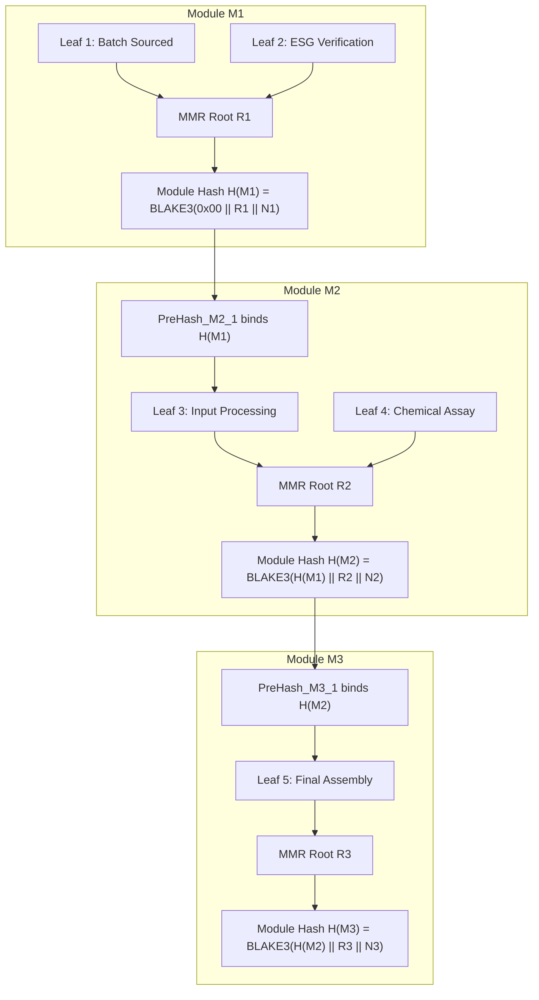
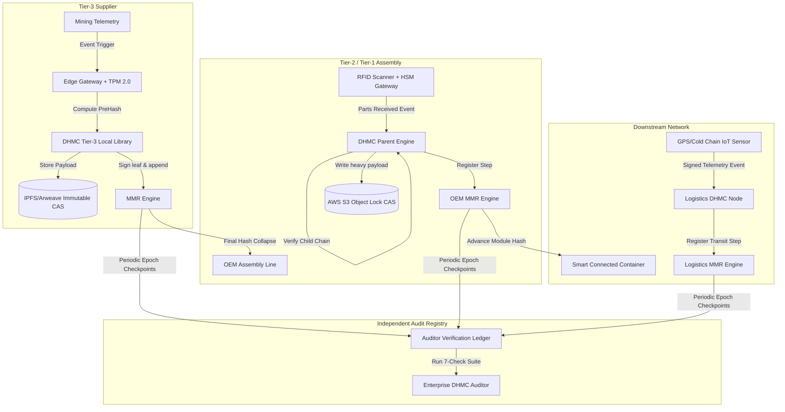
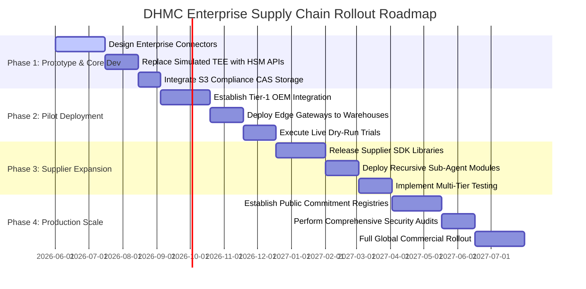
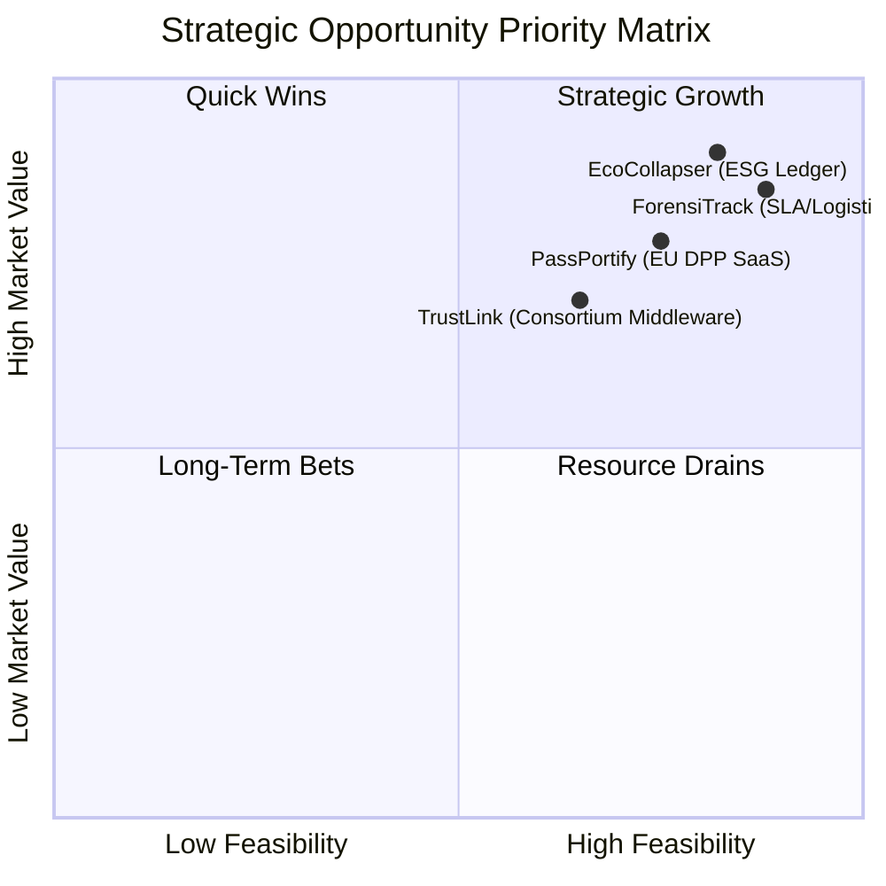

# Dynamic Hierarchical Merkle-Chain (DHMC) for Enterprise Supply Chains
## A Forensic-Grade Cryptographic Provenance Architecture for Multi-Tier Global Logistics & Manufacturing

---

## 1. Executive Summary

Modern enterprise supply chains face a systemic crisis of trust. Traditional Enterprise Resource Planning (SAP/Oracle), relational database architectures, and linear event-log frameworks are vulnerable to post-hoc tampering, unauthorized operational bypass, context hijacking, and systemic data manipulation. While block-chain systems have been proposed as the default remedy, their adoption remains severely throttled by high transaction costs, structural throughput bottlenecks, latency overheads, and the unacceptable commercial privacy risk of exposing proprietary multi-tier supplier networks to a shared ledger.

This analysis presents the translation of the **Dynamic Hierarchical Merkle-Chain (DHMC)** architecture—originally developed for state checkpointing in adaptive multi-agent LLM systems—into a **lightweight, forensic-grade, topology-aware enterprise provenance framework**. 

By intercepting and signing state transitions at the custody and physical transformation boundaries, DHMC establishes a tamper-proof digital twin of physical workflows. It operates as an additive, zero-modification security layer over existing ERP, Warehouse Management (WMS), and Transportation Management (TMS) systems. 

### The Core Value Proposition:
1. **Forensic-Grade Evidentiary Trail**: Post-execution tamper detection through mathematical proof cascade. Any retroactive changes to logistics records, quality metrics, or bills of material instantly invalidate the cryptographic chain.
2. **Dynamic Policy Enforcement (Schema Envelopes)**: Operational limits (routing paths, verification checks, volume thresholds) are pre-committed and validated dynamically at run-time, preventing "policy drift" or unauthorized supplier bypassing.
3. **Sub-Millisecond Performance ($<0.1$ ms Overhead)**: Utilizing hybrid hardware HSM/TEE-derived nonces and Merkle Mountain Range (MMR) epoch checkpointing, DHMC achieves processing throughput exceeding **500,000 operations per second**, bypassing the latency bottlenecks of blockchain networks.
4. **Commercial Privacy in Multi-Tier Ecosystems**: Leveraging the recursive sub-agent model (`spawn_subagent_dhmc` and `collapse_subagent`), Tier-1 OEMs can verify the complete provenance and ESG compliance of complex sub-assemblies without requiring Tier-N suppliers to expose their proprietary processes, pricing, or internal supply networks.

---

## 2. DHMC → Supply Chain Capability Mapping Matrix

| DHMC Core Component / Algorithm | Original Purpose in LLM Multi-Agent System | Modern Supply Chain / Logistics Equivalent | Required Modifications for Supply Chain | Expected Business Benefits | Potential Limitations |
| :--- | :--- | :--- | :--- | :--- | :--- |
| **DHMC Session (`session_id` / `thread_id`)** | Tracks a single multi-step user session or execution path through an LLM agent graph. | **Batch Run / Unique Product Journey** (e.g., a specific batch of pharmaceuticals, a unique VIN for an EV assembly). | Map to Global Trade Item Numbers (GTIN) or Serial Shipping Container Codes (SSCC) in ERP. | Absolute isolation of product histories; streamlined audits; precise tracing during targeted recalls. | Cross-session correlation requires separate indexing layers. |
| **Agent Node / Checkpoint Saver** | Intercepts node execution to write state variables to the checkpoint storage. | **Supply Chain Entity Node** (e.g., raw material warehouse, QA lab, transporter, assembly line, retail distributor). | Wrap local database triggers (e.g., SAP RFC, Postgres CDC) with a transparent wrapper equivalent to `DHMCWrappedCheckpointer`. | Additive, non-invasive security; zero modifications required on existing legacy ERP/WMS databases. | Requires robust Event-Driven Architecture (EDA) to prevent race conditions. |
| **Macro-Module State (`DHMCModuleState`)** | Groups steps into logical execution modules (e.g., intent parsing, RAG evaluation) enforcing strict boundary closures. | **Operational Phase / Logistics Tier** (e.g., Phase 1: Sourcing, Phase 2: Smelting, Phase 3: Manufacturing, Phase 4: Logistics). | Define macro-modules by geographical boundaries, custodian handoffs, or bills-of-materials layers. | Rigid phase boundaries prevent out-of-order operations (e.g., shipping a product before lab approval). | Re-opening closed modules (e.g., cargo re-routing) requires explicit cryptographic exception certificates. |
| **Step Record (`DHMCStepRecord`)** | Captures input, output, nonces, timestamp, and local binding of a single Pregel superstep execution. | **Physical or Digital Custody/Transformation Step** (e.g., receiving raw copper, heating metal, quality inspection co-signing). | Translate input/output payloads to GS1 EPCIS event XML/JSON standards. | Cryptographic binding of inputs (raw inputs) to outputs (finished goods) at every micro-transformation. | Increases storage footprint of event logs (mitigated by CAS isolation). |
| **Content-Addressable Storage (CAS)** | Isolates state payloads from the cryptographic chain, referencing them via their secure URI digests (`cas://sha256:hash`). | **Decentralized Document/Telemetry Store** (e.g., S3 Object Lock or IPFS storing heavy Bills of Materials, ESG PDFs, IoT logs). | Transition from in-memory dictionary to immutable cloud object storage with strict access control. | Massive reduction in chain sizes; immediate verification of document tampering; separation of data privacy from proof validity. | Requires robust cloud routing; retrieval latency is dependent on network file storage speeds. |
| **TEE Nonce Generator (`SimulatedTEEEnclave`)** | Generates secure nonces co-signed by simulated hardware enclave to prevent replay and prediction attacks. | **Hardware HSM / Smart IoT Secure Element** (e.g., AWS Nitro warehouses, IoT containers with Secure Elements, cryptographic NFC/RFID tags). | Interface `nonce_gen` with actual physical Hardware Security Modules (HSMs) or TPM 2.0 modules on edge gateways. | Closes physical-to-digital cloning vulnerabilities; prevents side-channel record fabrication or replay of historical proofs. | Hardware provisioning and key rotation overhead; edge internet connectivity dependencies. |
| **Schema Envelope (`SchemaEnvelope`)** | Pre-commits and validates structural operational guidelines (step counts, allowed step types, branching routing). | **Smart Compliance Contract / SLA Policy** (e.g., "Must pass third-party lab check, must have 3-5 transport updates"). | Map `allowed_types` to operational event types (e.g., `StepType.VALIDATION` = Lab QA; `StepType.TOOL` = GPS track). | Hard operational policy boundaries; automated rejection of unauthorized routing; strict, verifiable SLA conformance. | Needs a dynamic policy distribution framework (such as signed JWTs or decentralized public key infrastructure). |
| **Recursive Sub-Agents (`spawn` & `collapse`)** | Spawns child agent chains for sub-graphs and collapses their final hash to a single parent MMR leaf. | **Multi-Tier Supplier Nesting / Component Assembly** (e.g., assembling an engine out of sub-components from Tier-2 suppliers). | Execute `spawn_subagent_dhmc` at the purchase order trigger; pass genesis to supplier; collapse final hash on receipt of sub-component. | Absolute mathematical validation of Tier-2 provenance without exposing commercial secrets, supplier names, or pricing (Commercial Privacy). | Requires Tier-N suppliers to adopt compatible DHMC software libraries. |

---

## 3. Detailed Architectural Mapping

The DHMC codebase contains precise cryptographic formulas and data structures that transfer directly to supply chain architectures.

### A. The Cryptographic Custody and Transformation Binding Formula
At every transaction or manufacturing step, the DHMC checkpointer enforces strict cryptographic binding. In `dhmc/langgraph_checkpointer.py` (lines 185–209), the core mathematics of a step record are computed:

$$\text{PreHash}_{t,i} = \text{BLAKE3}(\text{StepID} \mathbin{\Vert} \text{InputPayload} \mathbin{\Vert} \text{Nonce}_{t,i} \mathbin{\Vert} H(M_{t-1}))$$

$$\text{PostHash}_{t,i} = \text{BLAKE3}(\text{StepID} \mathbin{\Vert} \text{OutputPayload} \mathbin{\Vert} \text{PreHash}_{t,i})$$

$$\text{Binding}_{t,i} = \text{BLAKE3}(\text{PreHash}_{t,i} \oplus \text{PostHash}_{t,i})$$

Where:
* **`StepID`** represents the unique transaction identifier (e.g., `M2:step:0002:receipt`).
* **`InputPayload`** represents the deterministic serialization (`_canonical_bytes`) of step inputs (e.g., the Bills of Materials serial numbers).
* **`Nonce`** is a secure cryptographic token fetched from `SimulatedTEEEnclave` (representing a physical HSM or IoT Secure Element).
* **$H(M_{t-1})$** is the cryptographic state of the preceding module chain, tying this physical action to the historical timeline of the product.
* **`OutputPayload`** represents the outputs (e.g., quality metrics, weight, new packaging identifier).
* **`Binding`** is the leaf appended to the Merkle Mountain Range.

#### Supply Chain Interpretation:
This formula ensures that an adversary cannot alter either the inputs (e.g., substituting cheap raw materials) or the outputs (e.g., fabricating high quality metrics) after the transaction has occurred. If the output payload is modified post-execution (as simulated in `simulate_post_execution_tamper`), the recomputed `PostHash` and subsequent `Binding` will mismatch the record, causing `DHMCAuditor` Check 4 (`Leaf hash recomputation`) to fail, pinpointing the exact breach step.

### B. Phase Boundary Enforcement ($H(M_t)$)
A supply chain consists of distinct operational phases (sourcing, manufacturing, customs, logistics). In `langgraph_checkpointer.py` (lines 237–274), the `close_module` function computes the cumulative commitment hash for a phase:

$$H(M_t) = \text{BLAKE3}(H(M_{t-1}) \mathbin{\Vert} R_t \mathbin{\Vert} N_t)$$

Where:
* **$H(M_{t-1})$** is the previous phase's cumulative commitment hash (the Genesis anchor for $M_1$ is $b'\x00' \times 32$).
* **$R_t$** is the final `MerkleMountainRange` commitment peak for the phase, representing all operations executed inside that phase.
* **$N_t$** is the step count inside this phase, preventing step deletion or omission attacks.

By linking $H(M_t)$ sequentially, DHMC ensures that a transporter in Phase 3 cannot alter the records of the chemical assay in Phase 2 or the origin certificate in Phase 1. The entire multi-company lifecycle is condensed into a single 32-byte peak hash ($H(M_{final})$), which can be written to a public registry or co-signed by an auditor, locking the history of the batch forever.

### C. Multi-Tier Privacy: Spawn & Collapse
In multi-tier supply chains, Tier-1 OEMs require absolute proof of Tier-3 compliance (e.g., conflict-free cobalt extraction), but Tier-2 component manufacturers refuse to expose their internal supplier directories or manufacturing recipe logs.

DHMC solves this via **Hierarchical Sub-Agent Collapsing** (`spawn_subagent_dhmc` and `collapse_subagent` in `langgraph_checkpointer.py`):
1. **Spawn**: The OEM’s parent system spawns a sub-agent checkpointer for the supplier. This co-signs the child’s genesis state:
   $$\text{SubAgentGenesis} = \text{BLAKE3}(H(M_{parent}) \mathbin{\Vert} \text{SpawnNonce})$$
2. **Execution**: The sub-contractor executes their entire internal processing, registering quality checks, supplier details, and local logistics in an independent, local DHMC checkpointer. These steps append to their private MMR.
3. **Closure**: The supplier closes their module, producing a private final hash: $H(M_{supplier})$.
4. **Collapse**: Upon component delivery, the parent checkpointer intercepts the transaction and calls `collapse_subagent`. This appends a single leaf to the parent MMR:
   $$\text{SubAgentLeaf} = \text{BLAKE3}(H(M_{supplier}) \mathbin{\Vert} \text{ParentStepID} \mathbin{\Vert} \text{SpawnNonceBinding})$$

This collapses the entire sub-supplier’s audit trail into a single cryptographic entry in the parent's ledger. A regulator can verify the sub-contractor's compliance by requesting their private chain keys and running the audit locally without exposing those steps to the OEM or other participants in the global network.

---

## 4. Enterprise Deployment Architecture

To transition DHMC from software simulation to production-grade supply chain infrastructure, we replace in-memory mechanisms with enterprise systems.

### A. The End-to-End Digital Provenance Architecture

### B. Hardware TEE/HSM Integration Model
In the codebase, `SimulatedTEEEnclave` (defined in `nonce_gen.py`) holds an in-memory `_session_key` and XORs random TRNG bytes with chain states. In production, this is replaced by a hardware-based **Root-of-Trust**:

1. **Edge Deployment (IoT Gateway)**: The edge gateway at a shipping warehouse or production plant is equipped with a **TPM 2.0 (Trusted Platform Module)** or a **Secure Element (e.g., ATECC608B)**.
2. **Verification Token Generation**: When a step executes (e.g., QA inspection passed), the gateway requests a hardware signature from the TPM. The signature is bound to:
   * The TPM's internal monotonic hardware counter (preventing log insertion or replay).
   * The unique physical signature of the operator (e.g., FIDO2 token co-signing).
   * The active physical sensor payload (e.g., GPS coordinates, temperature limits).
3. **Cryptographic Binding**: The hardware-derived signature is fed into `register_step` as the `nonce` argument, linking the digital cryptographic ledger directly to the physical environment.

### C. Content-Addressable Storage (CAS) Scale-Out Plan
The simulated CAS in `langgraph_checkpointer.py` uses an in-memory dictionary `self.cas_store = {}`. For enterprise scale (processing millions of daily steps), CAS payload storage is isolated from the cryptographic runtime:

1. **Storage Subsystem**: Heavy transactional payloads (e.g., PDFs, detailed IoT JSON logs, high-res packaging photos) are uploaded to an immutable storage system:
   * **Enterprise Cloud**: AWS S3 with **Object Lock** enabled in Compliance Mode (guaranteeing write-once-read-many WORM compliance).
   * **Decentralized Storage**: **IPFS** or **Arweave** for multi-company logistics.
2. **Digest Addressing**: The storage system returns a deterministic cryptographic digest (e.g., `cas://sha256:7a9f...`).
3. **State Capture**: Only the lightweight 32-byte digest is written to the DHMC step record, keeping the cryptographic chain extremely fast ($<1$ ms latency) while verifying that the underlying attachments have not been altered or deleted.

---

## 5. Commercial Product Opportunities

The unique features of the DHMC architecture present several highly lucrative commercial SaaS and enterprise infrastructure product opportunities.

### Product 1: **EcoCollapser (Recursive Scope-3 ESG Ledger)**
* **The Problem Solved**: Companies face strict ESG disclosure requirements (e.g., EU CSRD), which mandate reporting Scope 3 emissions (the carbon footprint of their entire supplier network). Tier-N suppliers refuse to share their energy bills and pricing structures, rendering emission calculations highly inaccurate and subject to greenwashing.
* **Target Customers**: Global enterprise brands (Automotive, Consumer Electronics, Textiles).
* **Competitive Advantage**: Utilizes the recursive `spawn` and `collapse` agent model. Tier-3 suppliers run localized DHMC chains calculating carbon intensity per kilogram of material. They collapse this into a single cryptographic commitment hash. The Tier-1 OEM receives a verified, mathematical proof of total product carbon intensity without accessing the supplier's private commercial networks.
* **Technical Feasibility**: High. The sub-agent collapsing logic is already implemented in `langgraph_checkpointer.py`. Integrates with carbon footprint modeling systems.
* **Monetization Model**: SaaS subscription tiered by annual carbon reporting volume, plus developer API fees for Tier-N supplier integrations.

### Product 2: **ForensiTrack (SLA compliance & Cargo Tamper Platform)**
* **The Problem Solved**: High-value cargo (pharmaceuticals, luxury items, semiconductor components) is regularly stolen, substituted, or exposed to temperature excursions during transit, leading to massive financial losses and liability disputes between shippers and carriers.
* **Target Customers**: Cold-chain logistics companies, pharmaceutical manufacturers, high-end electronics brands.
* **Competitive Advantage**: Implements TEE-backed nonces at the transit step level. IoT cellular trackers with Secure Elements record temperature and GPS variables directly into a local DHMC Merkle Mountain Range. The `DHMCAuditor`'s 7-check suite runs continuously. If a temperature breach occurs and someone attempts to rewrite the tracker logs post-hoc, the auditor immediately flags Check 4 and Check 7 failures, locating the exact time and location of the tamper event.
* **Technical Feasibility**: Very High. Relies directly on the core MMR engine (`mmr_engine.py`) and auditor (`auditor.py`).
* **Monetization Model**: Per-shipment transaction fees, plus enterprise subscriptions for the forensics dashboard.

### Product 3: **PassPortify (EU Digital Product Passport SaaS)**
* **The Problem Solved**: The European Union's Ecodesign Regulation mandates that products sold in the EU must have a **Digital Product Passport (DPP)** detailing chemical composition, repairability, recycling options, and component origins. Traditional centralized registers are distrusted by manufacturers.
* **Target Customers**: Manufacturers exporting goods to the European Union (Battery, Textile, and electronics industries).
* **Competitive Advantage**: Rather than forcing a costly blockchain system, PassPortify builds product passports as lightweight DHMC Merkle Mountain Ranges. Epoch checkpointing (`_close_epoch` in `mmr_engine.py`) allows customers or regulators to audit specific parts of a product's history (e.g., "Was the battery recycled in 2026?") in $O(\log E)$ time, bypassing the need to parse the entire history of the product.
* **Technical Feasibility**: High. Relies on the MMR epoch checkpointing algorithm, mapping epoch boundaries to custody handovers.
* **Monetization Model**: Per-product passport generation fees (charged per unique QR code printed on packaging), combined with compliance validation SaaS.

### Product 4: **TrustLink (Zero-Modification B2B Consortium Middleware)**
* **The Problem Solved**: Current B2B consortium networks (Hyperledger/Corda) require heavy developer resources, change management, and massive integration overhead across dozens of legacy ERP systems, resulting in high failure rates for blockchain projects.
* **Target Customers**: Multi-party supply chain consortia (Defense Logistics, Aerospace manufacturing, Global Grain Trade).
* **Competitive Advantage**: An additive, non-intrusive middleware utilizing the decorator pattern. It wraps existing databases and API endpoints with zero modifications to legacy schemas (identical to `DHMCWrappedCheckpointer` wrapping the `BaseCheckpointSaver` interface). It intercepts SAP IDoc exchanges or EDI transactions to compute state bindings and syncs them to a lightweight local audit ledger.
* **Technical Feasibility**: High. The zero-modification intercept pattern is demonstrated in `dhmc_langgraph_wrapper.py` and is directly applicable to standard Enterprise Service Buses (ESB) like MuleSoft or Dell Boomi.
* **Monetization Model**: Enterprise license fee per connected node plus annual maintenance agreements.

---

## 6. Competitive Comparison Table

| Feature / Dimension | Traditional ERP Systems (SAP/Oracle SCM) | Public Blockchain (Ethereum) | Consortium Blockchain (Hyperledger Fabric) | Event Sourcing Architectures | **DHMC Enterprise Provenance Framework** |
| :--- | :--- | :--- | :--- | :--- | :--- |
| **Write Latency** | Ultra-low ($<1$ ms) | Very High (12s – 15min block times) | High (50ms – 2s transaction endorsement) | Ultra-low ($<1$ ms) | **Ultra-low ($<0.1$ ms)** |
| **Transaction / Gas Cost** | Zero (Internal hosting cost) | Extremely High (Gas fees per state change) | Low (Infrastructure/Node hosting fees) | Zero (Internal hosting cost) | **Zero** (Negligible local cryptographic hashing cost) |
| **Multi-Tier Privacy** | Absolute (but siloed; no trust across tiers) | Zero (All data/roots are public) | Medium (Requires channels; complex to manage) | Absolute (but siloed; no cross-company trust) | **Absolute** (Hierarchical `spawn`/`collapse` maps supplier boundaries cleanly) |
| **Tamper Evidence** | Poor (Administrators can alter logs post-hoc) | Cryptographically Absolute | Cryptographically Absolute | Low (Logs can be rewritten if database is compromised) | **Cryptographically Absolute** (Forensic-grade Cascade Invalidation) |
| **System Modification** | High (Requires custom database tables & APIs) | Total Rewrite (Requires migrating to Smart Contracts) | High (Requires building chaincode & consensus nodes) | High (Requires architectural migration) | **Zero-Modification** (Additive decorator pattern over existing endpoints) |
| **SLA/Policy Enforcement** | Application-level (Vulnerable to DB bypass) | Smart Contract-level (Inflexible) | Chaincode-level (Hard to update) | None (Requires downstream validation services) | **Pre-committed Schema Envelopes** (Validated at checkpoint boundary) |
| **Throughput (Ops/sec)** | High ($>50,000$) | Extremely Low (15 – 30 tps) | Low – Medium (1,000 – 3,000 tps) | High ($>100,000$) | **Extremely High ($>500,000$)** (Based on `benchmark.py` MMR results) |

---

## 7. Research & Patent Opportunities

Combining DHMC with physical supply chains opens several highly defensible, patentable technological innovations.

### Patent 1: **"Recursive Merkle-Chain Collapsing for Multi-Tier Commercial Privacy Preservation"**
* **Core Claim**: A method for verifying multi-company supply chain compliance by spawning a child cryptographic ledger co-signed by a parent genesis state, executing transaction step bindings inside the child ledger, closing the child ledger with a final module hash commitment, and collapsing the closed child ledger into a single leaf hash of the parent ledger's Merkle Mountain Range.
* **Why it's Differentiated**: Existing blockchain solutions (like Hyperledger private channels) require standing up isolated infrastructure for every supplier configuration. This method achieves mathematical provenance verification without requiring suppliers to share their operational data, preserving absolute privacy with lightweight, local cryptographic structures.

### Patent 2: **"Hardware-Bounded Cryptographic Nonces for Physical-to-Digital Supply Chain Custody Tracking"**
* **Core Claim**: A system for preventing transaction fabrication in event logs, comprising a physical edge gateway with a Hardware Security Module (HSM), a state tracking computer generating step transaction records, wherein the HSM fetches the active cryptographic hash of the entire multi-company ledger, XORs the ledger state hash with hardware-derived true random entropy, and signs the resulting nonce to bind the step transaction record directly to the physical custody exchange event.
* **Why it's Differentiated**: Traditional IoT trackers simply sign data packets. If the backend database is compromised, an attacker can fabricate historical logs. By binding the hardware-derived nonce directly to the active, live state of the entire multi-company ledger hash ($H(M_{t-1})$), this system makes it mathematically impossible to rewrite history or inject fraudulent transaction logs post-hoc.

### Patent 3: **"Policy-Bounded Schema Envelopes for Dynamic Event Routing Compliance"**
* **Core Claim**: A computer-implemented method for enforcing transaction compliance at the database commit boundary, comprising pre-committing a signed schema envelope defining maximum and minimum step ranges, allowed event types, and permitted routing branches, intercepting event writes at the database transaction boundary, dynamically validating the active step sequence against the signed schema envelope, and rejecting the database commit upon detecting structural deviations.
* **Why it's Differentiated**: Standard compliance tools check policies downstream after a transaction is committed. This method performs real-time, zero-modification interception directly at the database persistence layer, guaranteeing that no unauthorized steps are ever committed to the ledger.

---

## 8. Risk Assessment

| Risk Vector | Description / Impact | Severity | Mitigations |
| :--- | :--- | :--- | :--- |
| **Hardware TEE Integration Complexity** | Reliance on physical HSMs or edge Secure Elements increases hardware costs and provisioning overhead for Tier-N suppliers. | **Medium** | Provide a hybrid software-fallback model using secure cloud KMS (e.g., AWS KMS or HashiCorp Vault) for smaller suppliers lacking hardware HSMs. |
| **Key Management and Leakage** | If a participant leaks their private session keys, an attacker can sign fabricated steps, compromising the local chain's credibility. | **High** | Implement strict, short-lived session keys backed by automated rotation policies inside hardware HSMs. Use remote attestation to verify node integrity. |
| **Oracle Problem (Data Inaccuracy)** | While DHMC guarantees that logged data has not been altered, it cannot prove that the initial physical input was accurate (e.g., registering low-grade steel as high-grade). | **High** | Pair DHMC steps with automated IoT sensor verifications, AI-driven visual quality checks, and independent, third-party lab co-signers (`StepType.VALIDATION`). |
| **Legacy Integration Friction** | Connecting `DHMCWrappedCheckpointer` to custom legacy ERP systems with proprietary architectures may encounter integration bottlenecks. | **Medium** | Develop standardized connector libraries for leading ERP and ESB platforms (SAP, Oracle, MuleSoft, Boomi), abstracting the wrapping logic into reusable API gateways. |

---

## 9. Implementation Roadmap

### Phase 1: Prototype and Core Development (Months 1–3)
* **Goal**: Transition the core DHMC codebase to enterprise-grade cloud systems.
* **Key Tasks**:
  1. Replace the Simulated TEE with production cloud HSM and TPM 2.0 gateway interfaces.
  2. Implement the CAS integration layer with AWS S3 Object Lock and IPFS.
  3. Package the transparent `DHMCWrappedCheckpointer` as a standalone middleware module.

### Phase 2: Pilot Integration (Months 4–6)
* **Goal**: Validate DHMC in a live, single-tier enterprise pilot.
* **Key Tasks**:
  1. Integrate the DHMC middleware into a Tier-1 OEM’s assembly WMS (e.g., SAP EWM).
  2. Deploy HSM-enabled edge gateways to track a high-value product batch from assembly to dispatch.
  3. Run continuous audits using the `DHMCAuditor` suite to verify system stability.

### Phase 3: Multi-Tier Ecosystem Expansion (Months 7–9)
* **Goal**: Launch the recursive sub-agent framework for multi-tier tracking.
* **Key Tasks**:
  1. Distribute lightweight supplier SDKs to select Tier-2 components suppliers.
  2. Implement the `spawn_subagent_dhmc` and `collapse_subagent` protocols to track assemblies.
  3. Validate commercial privacy controls, proving that the parent ledger contains no private supplier directories.

### Phase 4: Global Production Scale (Months 10–12)
* **Goal**: Full commercial launch and compliance auditing.
* **Key Tasks**:
  1. Establish public commitment registers to anchor final cumulative module hashes ($H(M_{final})$).
  2. Undergo third-party SOC2 Type II and cybersecurity penetration audits.
  3. Scale-out SaaS platforms (EcoCollapser, PassPortify) to global commercial clients.

---

## 10. Priority-Ranked Opportunities

Our commercial and technical assessment ranks these strategic opportunities by business impact, implementation feasibility, and overall market value.

### 1. **EcoCollapser (Recursive Scope-3 ESG Ledger)**
* **Impact**: **High** (solves the critical, legally binding CSRD multi-tier emissions tracking challenge).
* **Feasibility**: **High** (recursive collapsing is already core to the codebase).
* **Market Value**: **High** (massive compliance software market expansion).
* **Priority**: **1**

### 2. **ForensiTrack (SLA compliance & Cargo Tamper Platform)**
* **Impact**: **High** (protects high-value shipping lines against theft and temperature excursions).
* **Feasibility**: **Very High** (maps cleanly to standard IoT tracker data and the existing auditor suite).
* **Market Value**: **High** (directly reduces cargo insurance premiums).
* **Priority**: **2**

### 3. **PassPortify (EU Digital Product Passport SaaS)**
* **Impact**: **Medium-High** (essential for EU trade compliance).
* **Feasibility**: **High** (leverages the MMR epoch checkpointing algorithm).
* **Market Value**: **Medium-High** (niche market with solid, regulations-driven recurring revenue).
* **Priority**: **3**

### 4. **TrustLink (Zero-Modification B2B Consortium Middleware)**
* **Impact**: **Medium** (highly efficient blockchain alternative for multi-party networks).
* **Feasibility**: **Medium** (requires building custom connectors for disparate legacy systems).
* **Market Value**: **Medium-High** (valuable enterprise software play).
* **Priority**: **4**
